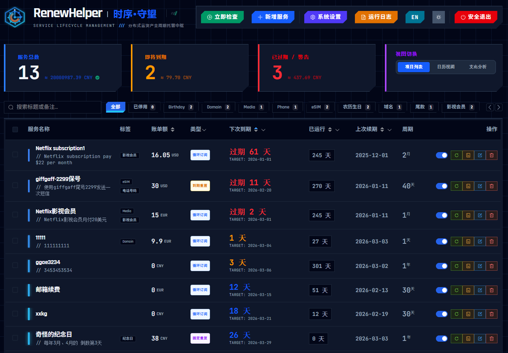
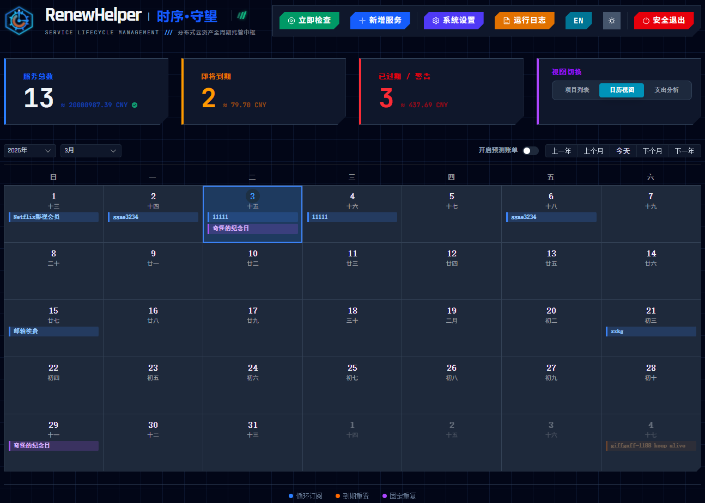
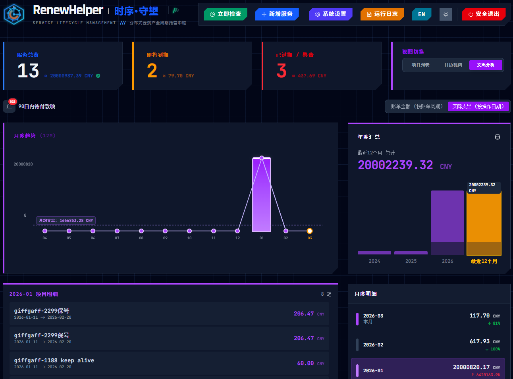
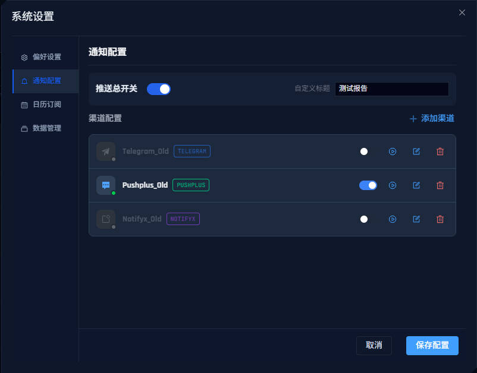
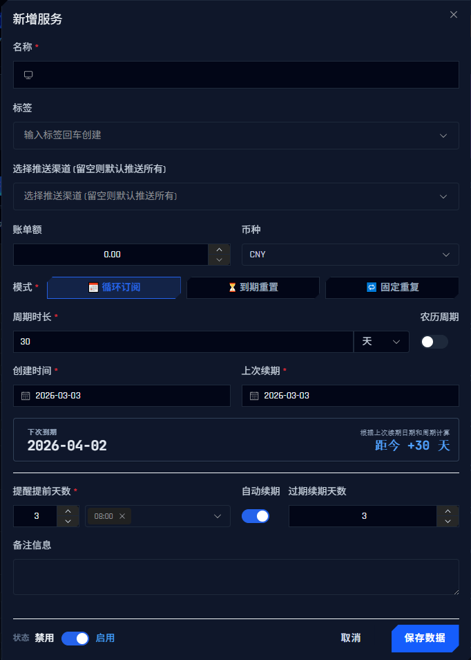

# 🕒 RenewHelper - 时序·守望 (Service Lifecycle Manager)

[English](./README_EN.md) | **中文**


**RenewHelper - 时序·守望** 是一款基于 **Cloudflare Workers** 的全栈服务生命周期提醒、管理工具。它专为管理周期性订阅、域名续费、服务器到期等场景设计。无需服务器，零成本托管，提供精美的机甲风（Mecha-style）UI 界面、强大的农历/公历计算核心、多渠道通知推送能力以及 iCal 日程同步。**同时支持Worker方式和Docker方式部署。v2.x新增资金流向看板，拥有完善的账单管理功能。v3.x前后端完全分离重构，不依赖任何CDN引入即可独立运行。**

<div align="center">
  
  
  
</div>

## ✨ 核心特性

- **⚡️ Serverless 架构**：完全运行在 Cloudflare Workers 上，利用 KV 存储数据，无需购买 VPS，免费额度通常足够个人使用。并同时支持单机Docker方式部署，不依赖任何CDN引入即可独立运行。
- **📅 智能周期管理**：
  - 支持**公历**与**农历**（Lunar）周期计算。内置高精度农历算法（1900-2100），支持公历循环（如月付/年付）和农历循环（如生日、传统节日）。
  - 支持按天、月、年为周期的自动推算。
  - 提供“循环订阅”、“到期重置”及“固定重复”三种模式。
- **🔔 多渠道通知**：
  - 内置支持 **Telegram, Bark, PushPlus, Server酱3, 钉钉 (DingTalk), 飞书 (Lark), 企微 (WeCom), NotifyX, Resend (Email), Gotify, Ntfy, Webhook**。
  - 允许添加**无限个**推送渠道，支持为每个项目配置不同的推送渠道。支持**批量管理**与**快速分配**。
  - 支持自定义推送标题、提前提醒天数和每日推送时间。
- **💰 资金流向看板** (New v2.0+)：
  - 提供精美的账单统计视图，支持按月、按年查看消费趋势。
  - 支持**多币种**混合统计（自动汇率转换）。
  - 支持区分**账单金额**（预算）与**实际支出**（实付）。
  - 提供未来 n 天待付账单预览。
- **🤖 自动化管理**：
  - **自动续期**：到期自动更新下次提醒时间。
  - **自动禁用**：过期太久未处理的服务自动标记为禁用。
  - **Cron 触发**：支持通过 Cloudflare Cron Triggers 每日定时检查。
- **📆 直观日历 & ICS 订阅**：
  - 提供内置的**日历可视化面板**，可直观查看当月各种续费事件及未来的预测待办。
  - 提供标准的 `.ics` 订阅链接，可完美接入 iOS 日历、Google Calendar 或 Outlook，支持基于时区的精确提醒并同步到您的手机日程中。
- **🛡️ 安全可靠**：
  - JWT 身份验证，支持高强度密钥自动生成。
  - 混合限流策略（内存 + KV），防止暴力破解。
  - 数据仅存储在您私有的 Cloudflare KV 中。
  - 敏感操作（删除、重置）二次确认。
- **🎨 现代化 UI**：
  - Vue 3 + Element Plus 构建的单文件前端。
  - 支持深色/浅色模式切换，并内置平滑的视图切换过渡动画。
  - 支持便捷的列表多选与批量操作（批量删除、启停、分配通知渠道）。
  - 响应式设计，完美适配移动端和桌面端。
  - 中英双语界面。
  - 支持数据导入/导出备份。

---

## 🚀 部署指南

### 方式一：自动一键部署 (推荐)

[](https://deploy.workers.cloudflare.com/?url=https://github.com/ieax/renewhelper)

1.  点击上方按钮。
2.  授权 Cloudflare 访问您的 GitHub 账户（用于 Fork 仓库）。
3.  按照指引完成部署，Cloudflare 会自动为您创建 Worker 和 KV 命名空间。
4.  **重要**：部署完成后，请进入 Cloudflare Dashboard -\> Workers & Pages -\> 您的项目 -\> **Settings/设置** -\> **Variables/变量**。
    - 添加环境变量：`AUTH_PASSWORD`，值为您想设置的登录密码（默认为 `admin`）。
    - 绑定 KV 命名空间：确保变量名为 `RENEW_KV`（不能改！！！）。

### 方式二：网页手动部署 (新手推荐)

如果您没有 Github，可以直接在 Cloudflare 网页后台完成部署。

#### 第一步：创建 KV 存储桶

1.  登录 [Cloudflare Dashboard](https://dash.cloudflare.com/)。
2.  在左侧菜单点击 **Workers & Pages** -> **KV**。
3.  点击 **Create a namespace**。
4.  输入名称：`RENEW_KV`或其他任意名称 (建议大写，方便识别)，点击 **Add**。

#### 第二步：创建 Worker 服务

1.  回到 **Workers & Pages** -> **Overview** 页面。
2.  点击 **Create application** -> **Create Worker**。
3.  给 Worker 起个名字，例如 `renewhelper`，点击 **Deploy**。
4.  部署成功后，点击 **Edit code** 进入代码编辑器。

#### 第三步：粘贴代码

1.  在代码编辑器左侧的文件列表中，选中 `worker.js`。
2.  **全选并删除**里面的所有默认代码。
3.  将本项目提供的 `_worker.js` 完整代码复制并粘贴进去。
4.  点击右上角的 **Deploy** 按钮保存代码。

#### 第四步：绑定 KV 数据库 (关键)

1.  点击左上角的箭头返回到 Worker 的详情页面 (或者点击顶部的 Worker 名称)。
2.  点击 **Settings** (设置) -> **Variables** (变量)。
3.  向下滚动找到 **KV Namespace Bindings** (KV 命名空间绑定)。
4.  点击 **Add binding**：
    - **Variable name (变量名)**: 必须填写 `RENEW_KV` (不能改！！！)。
    - **KV Namespace (命名空间)**: 下拉选择你在第一步创建的那个存储桶。
5.  点击 **Save and deploy**。

#### 第五步：设置登录密码

1.  还在 **Variables** 页面，向上滚动找到 **Environment Variables** (环境变量)。
2.  点击 **Add variable**：
    - **Variable name**: `AUTH_PASSWORD`
    - **Value**: 输入你想设置的后台登录密码 (如果不设置，默认为 `admin`)。
3.  点击 **Save and deploy**。

#### 第六步：设置定时任务 (Cron)

为了让自动续期功能生效，**须要设置定时触发器。**

1.  点击页面顶部的 **Triggers** (触发器) 标签。
2.  向下滚动找到 **Cron Triggers**。
3.  点击 **Add Cron Trigger**。
4.  **Cron schedule**: 准确输入 `0,30 * * * *` (代表 UTC 时间每天每个半点检查一次，不能改！！！)。
5.  点击 **Add Trigger**。

### 方式三：GitHub Actions 部署 (进阶推荐)

此方法适合希望**自动同步更新**且关注**隐私安全**的用户。您无需授权第三方应用，所有密钥均存储在您自己的 GitHub 仓库中。

1.  **Fork 项目**：点击本项目右上角的 **Fork** 按钮，将仓库复制到您的 GitHub 账户。
2.  **准备 Cloudflare 密钥**：
    - **Account ID**：登录 Cloudflare Workers 首页右侧获取。
    - **API Token**：[My Profile](https://dash.cloudflare.com/profile/api-tokens) -> API Tokens -> Create Token -> 选择 **Edit Cloudflare Workers** 模板 -> 生成并复制。
3.  **创建 KV 数据库**：
    - 在 Cloudflare 后台创建一个 KV 命名空间（如 `RENEW_KV`）。
    - 复制该 KV 的 **ID**。

4.  **配置 GitHub Secrets**：
    - 进入您 Fork 的仓库 -> **Settings** -> **Secrets and variables** -> **Actions**。
    - 点击 **New repository secret**，依次添加4个变量：
        - `CF_API_TOKEN`: 填入您的 API Token。
        - `CF_ACCOUNT_ID`: 填入您的 Account ID。
        - `CF_KV_ID`: 填入您刚刚复制的 KV ID (Actions 会自动注入)。        
        - `AUTH_PASSWORD`: 填入您的登录密码(设置后，即使同步代码也不会被覆盖)。

5.  **启用并部署**：
    - 进入 **Actions** 标签页，点击绿色按钮 **I understand my workflows...** 启用。
    - 在左侧选择 **Deploy to Cloudflare Workers**，点击右侧 **Run workflow** 手动触发首次部署。
    - **后续更新**：每当原作者发布新版本，您只需在 GitHub 点击 Sync Fork，Actions 会自动将最新代码（含新功能）部署到您的 Worker，同时保留您的密码设置。

### 方式四：Docker部署

RenewHelper 支持通过 Docker 进行一键私有化部署。该方案利用 Miniflare 在本地模拟 Cloudflare Workers 环境，配合 Node-cron 实现稳定的定时任务，确保数据完全掌握在您自己手中。

#### 准备工作

  * 服务器需安装 Docker 和 Docker Compose。

#### 快速开始

1.  VPS新建一个文件夹（例如 `renewhelper`）。
2.  在文件夹中创建一个名为 `docker-compose.yml` 的文件，填入以下内容：

```yaml
services:
  renew-helper:
    # 官方镜像地址
    image: ieax/renewhelper:latest
    container_name: renew-helper
    restart: unless-stopped
    ports:
      - "9787:9787" # 将容器内部的 9787 端口映射到宿主机的 9787
    volumes:
      # 数据持久化：将宿主机的 ./data 目录挂载进去，防止重启丢失数据
      - ./data:/data
    environment:
      # --- 核心配置 ---
      
      # 1. 登录密码 (必填)
      - AUTH_PASSWORD=你的访问密码
      
      # 2. 定时任务频率 (关键配置)
      # 建议：设置为每30分钟运行一次，不要修改！！！
      # 语法："0,30 * * * *" 表示在每小时的第0分和第30分各触发一次。
      - CRON_SCHEDULE=0,30 * * * *
      
      # 3. 容器时区
      # 决定了 Cron 什么时候"醒来"，建议设置为你所在的地区
      - TZ=Asia/Shanghai
```

3.  启动服务：

    ```bash
    docker compose up -d
    ```

4.  **配置 HTTPS 反向代理 (必须)**：由于后端核心加解密依赖浏览器 **Web Crypto API**，RenewHelper **必须在 HTTPS 环境下** 才能正常工作（localhost 除外）。请务必配置 Nginx、Caddy 或其他反代工具加上 SSL 证书。

---

<details>
<summary><strong>🔒 部署指南: 点击展开 Caddy 反代配置 (推荐)</strong></summary>

#### 1\. 修改 `docker-compose.yml`

请参照下方配置修改您的文件，添加 Caddy 服务。

```yaml
services:
  renew-helper:
    image: ieax/renewhelper:latest
    container_name: renew-helper
    restart: unless-stopped
    # 移除 ports 映射，只暴露端口给 Caddy，更安全
    expose:
      - "9787"
    volumes:
      - ./data:/data
    environment:
      - AUTH_PASSWORD=admin
      - CRON_SCHEDULE=0,30 * * * *
      - TZ=Asia/Shanghai

  caddy:
    image: caddy:alpine
    container_name: caddy-proxy
    restart: unless-stopped
    ports:
      - "80:80"   # HTTP
      - "443:443" # HTTPS
    volumes:
      - ./Caddyfile:/etc/caddy/Caddyfile
      - caddy_data:/data
      - caddy_config:/config
    depends_on:
      - renew-helper

volumes:
  caddy_data:
  caddy_config:
```

#### 2\. 创建 `Caddyfile`

在项目根目录下创建一个名为 `Caddyfile` 的文件（注意没有后缀名）：

```caddy
# 请将此处替换为您解析好的域名
your-domain.com {
    encode gzip
    # renew-helper 是 docker 服务名，9787 是容器内部端口
    reverse_proxy renew-helper:9787
}
```

#### 3\. 启动服务

```bash
docker compose up -d
```

>启动后，Caddy 会自动申请 SSL 证书，您可以通过 `https://您的域名` 安全访问服务。
</details>

#### ⚠️ 重要提示：时区设置

为了确保通知时间准确，请确保以下两处设置一致：

1.  **Docker 环境变量 (`TZ`)**：决定了 RenewHelper 什么时候**醒来**执行检查。
2.  **网页端 -\> 系统设置 -\> 偏好时区**：决定了 RenewHelper 醒来后，**认为现在是几点**。

#### 💾 数据备份与迁移

  * **数据位置**：所有数据（订阅列表、系统配置、日志）都保存在 `docker-compose.yml` 同级目录下的 `./data` 文件夹中。
  * **备份**：直接复制或压缩 `./data` 文件夹即可。
  * **迁移**：在通过 Docker 部署新实例时，将备份的 `./data` 文件夹放入目录，启动后数据会自动恢复。

#### 🔄 更新版本

当项目发布新版本时，执行以下命令即可更新：

```bash
# 1. 拉取最新镜像
docker compose pull

# 2. 重建并重启容器
docker compose up -d
```

### Telegram 代理服务部署 (可选)

> ⚠️ **仅适用于中国大陆用户**：由于网络原因，国内服务器可能无法直接连接 Telegram API。您可以部署本项目提供的轻量级反代，同时兼容Worker/Pages/Snippets，建议部署方式：Snippets（无次数限制速度快） > Pages（无次数限制） > Worker（有次数限制）。

1.  **准备文件**：复制本项目 `renewhelper/telegram_proxy/_worker.js` 的代码。
2.  **创建 Worker/Pages/Snippets**：
    *   在 Cloudflare 后台创建一个新的 Worker/Pages/Snippets（例如命名为 `tg-proxy`）。
    *   粘贴代码并部署。
3.  **配置白名单 (变量名: `TG_ALLOW_TOKENS`)**：
    *   在 Worker/Pages 设置 -> 变量中，添加 `TG_ALLOW_TOKENS`(Pages需要重新部署一遍生效)。
    *   值填写您的 Bot Token（如果有多个用逗号分隔）。
    *   *如果不配置环境变量，需手动修改代码中的 `WHITELIST_TOKENS` 常量。*
4.  **使用**：
    *   您的代理地址为：`https://tg-proxy.您的子域名.workers.dev` 或您的自定义域名。
    *   此服务可作为 Telegram API 的透明代理，支持 `POST /bot<Token>/<Method>` 格式的请求。
    *   *注：此脚本主要用于解决 Docker 部署环境下或特定网络环境下无法访问 Telegram API 的问题。*

### 🎉 部署完成！

---

## ⚙️ 设置与配置

部署成功后，访问您的 Worker 域名或您添加的自定义域名（如 `https://renewhelper.your-name.workers.dev`或 `https://renewhelper.your-domain.com`）。

1.  **首次登录**：使用您设置的 `AUTH_PASSWORD`（默认 `admin`）解锁。
2.  **系统设置**：点击控制台右上角的 **系统设置 (SETTINGS)** 按钮。
    - **时区设置**：非常重要！请选择您所在的时区（如 `Asia/Shanghai`），这决定了提醒和日历的准确性。
    - **通知总开关**：开启后可配置具体的推送渠道。

<div align="center">
  
</div>

### 📢 推送渠道配置说明

在“系统设置” -> “通知配置”区域，点击 **添加渠道** 按钮，选择类型并填写参数。系统支持同时配置**无限个**推送渠道。配置完成后支持**发送测试**以验证连通性，并可通过列表上方的**全选/反选**及**批量操作栏**进行启用、禁用、删除或**一键分配**给指定服务。

| 渠道              | 参数说明                                                           | 获取/配置方法                                                                                                                                                                                                                               |
| :---------------- | :----------------------------------------------------------------- | :------------------------------------------------------------------------------------------------------------------------------------------------------------------------------------------------------------------------------------------ |
| **Telegram**      | **Token**: 机器人令牌<br>**Chat ID**: 您的用户 ID 或群组 ID<br>**Server**: (可选) 自定义 API 地址 | 1. 找 [@BotFather](https://t.me/BotFather) 创建机器人获取 Token。找`@userinfobot`获取UserID。<br>2. 或浏览器访问 `https://api.telegram.org/bot<YourToken>/getUpdates` <br>3. 添加您的机器人为好友，并发送任意消息给机器人。<br>4. 在刚才打开的 URL 页面刷新获取 Chat ID。<br>5. **Server**: 默认为 `https://api.telegram.org`。如需使用反代，请填入完整地址（如您的 [Telegram 反代服务](#telegram-代理服务部署-可选) URL`https://tg-proxy.your-name.pages.dev`）。 |
| **Bark** (iOS)    | **Server**: 服务器地址<br>**Device Key**: 设备密钥                 | 1. App Store 下载 Bark 应用。<br>2. 复制 App 内显示的服务器地址和 Key。                                                                                                                                                                     |
| **PushPlus**      | **Token**: 用户令牌                                                | 1. 访问 [PushPlus 官网](https://www.pushplus.plus/)。<br>2. 微信扫码登录获取 Token。                                                                                                                                                        |
| **NotifyX**       | **API Key**: 密钥                                                  | 1. 访问 [NotifyX 官网](https://www.notifyx.cn/)。 <br>2. 微信扫码登录获取 API Key。                                                                                                                                                         |
| **Resend** (邮件) | **API Key**: Resend 密钥<br>**From**: 发件地址<br>**To**: 收件地址 | 1. 注册 [Resend](https://resend.com/)。<br>2. 绑定域名并获取 API Key。<br>3. `From` 必须是您验证过的域名邮箱（如 `alert@yourdomain.com`）。若您没有域名邮箱，可以使用`onboarding@resend.dev`，发送至您注册 resend 账号的邮箱。              |
| **Lark** (飞书)   | **Token**: Webhook 地址中的 UUID<br>**Secret**: (可选) 安全签名密钥 | 1. 在飞书群设置 -> 机器人 -> 添加机器人 -> 自定义机器人。<br>2. 复制 Webhook 地址结尾的 UUID（例如：`xxxxxxxx-xxxx-...`）填入 Token 中。<br>3. 选填加签密钥。                                         |
| **WeCom** (企微)  | **Key**: Webhook 地址中的 key 参数                              | 1. 在企业微信群设置 -> 添加群机器人。<br>2. 获取 Webhook 地址，并仅提取 `key=` 后面的参数名部分（例如：`693...`）。                                                           |
| **Gotify**        | **Server**: 服务器地址<br>**Token**: 应用 Token                    | 自建 Gotify 服务器，创建一个 Application 获取 Token。                                                                                                                                                                                                       |
| **Ntfy**          | **Server**: 服务器 (默认 ntfy.sh)<br>**Topic**: 主题<br>**Token**: 令牌 | 1. **Server**: 若自建则填自建地址，否则留空默认为 `https://ntfy.sh`。<br>2. **Topic**: 您订阅的主题名称。<br>3. **Token**: (可选) 如果主题受保护，需填写 Access Token，否则留空。                                                                           |
| **Server酱3**     | **UID**: 用户ID<br>**SendKey**: 发送密钥                       | 1. 登录 [Server酱3](https://sc3.ftqq.com/)。<br>2. 获取 UID 和 SendKey。                                                                                                                                                                          |
| **钉钉** (DingTalk)| **Token**: access_token<br>**Secret**: (可选) 加签密钥 | 1. 钉钉群设置 -> 智能群助手 -> 添加机器人 -> 自定义。<br>2. 安全设置推荐勾选 **加签** (Secret) 或 **自定义关键词** 。<br>3. 复制 Webhook 地址中的 `access_token` 和加签的 `SEC...` (即 Secret)。若使用自定义关键词记得放行`Renew`，否则无法收到通知。                                                           |
| **Webhook**       | **URL**: POST 地址                                                 | 适用于自定义开发。系统会向该 URL 发送 POST 请求：`{ "title": "...", "content": "..." }`。[WEBHOOK 配置教程](./webhook_guide_zh.md)                                                                                                                                                   |

---

## 🛠 使用方法

### 添加服务

<div align="center">
  
</div>

- **名称**：服务的名称（如 "Netflix 4K"，"Google Voice - 8888"）。
- **标签**：用于分类（如 `Media`, `Server`, `Domain`, `PhoneNumber`），支持多选。
- **模式**：
  - 📅 **循环订阅(Cycle)**：每隔固定周期（如 1 个月/1 个自然年/1 个农历年）到期的各种事项，如月付会员订阅、年付 VPS 续费等。
  - ⏳ **到期重置(Reset)**：到期后需手动或自动处理，有效期随之展期的各种事项，如 eSIM 动账延长 180 天有效期、签到增加服务时长等。
  - 🔁 **固定重复(Repeat)**：基于强大的 RRULE 规则引擎打造。适用于“每月的第二个星期五”、“每两个星期的周三和周日”这类按自然习惯定期的事件。
- **农历开关**：开启后，周期将按农历计算（适合农历生日、事物提醒）。
- **提前提醒**：可自由选择需要提前多少天收到通知，支持提醒时间**多选**（例如同时勾选“8:00”和“18:00”接收推送）。
- **自动化策略**：
  - **自动续期**：到期后自动将下次到期日顺延一个周期。
  - **自动禁用**：到期超过指定天数未处理，自动标记为禁用。
- **续费链接**：
  - 可选，填写后在手动续期页面中会出现“去续期”按钮，帮助用户快速跳转至目标网站进行续期操作。  

### 批量操作
在项目列表视图，您可以勾选列表左侧的复选框，进行多项服务的**批量删除**、**批量暂停/启用**检查，以及最为实用的**批量分配通知渠道**功能（快速为一组服务绑定相同的推送通道）。

### 查看日志

点击主界面的 **运行日志 (LOGS)** 按钮，可查看所有自动化任务的历史记录、推送结果以及操作审计。

### ICS 日历订阅 & 日历视图

在主界面不仅可以点击右上角切换至**日历直观视图**（不仅直观展示当月的续费事件，还可以点击顶部开关，显示未来推测的待付项目点）。
在“系统设置”选项中更可获取**日历订阅**提取网址：

1.  复制订阅链接。
2.  **iOS**: 设置 -\> 邮件 -\> 账户 -\> 添加账户 -\> 其他 -\> 添加已订阅的日历。
3.  **Google Calendar**: 添加日历 -\> 来自 URL 或从订阅链接下载后文件导入。
4.  **Outlook**: 文件 -\> 添加日历 -\> 从 WEB 订阅或从订阅链接下载后文件导入。
5.  **手机自带日程 APP**: 在 CalDAV 服务商添加订阅链接，手机添加 CalDAV 订阅信息进行日程同步或从订阅链接下载后，在日程软件中导入。
6.  **注意**: 链接包含安全 Token，请勿泄露。如泄露可点击“重置令牌”。

### 💰 资金流向 (Billing Stats)

点击主界面底部的切换按钮，进入 **资金流向看板**：

1.  **月度趋势**：查看过去 12 个月的消费曲线。
2.  **年度汇总**：查看近 3 年的年度总支出。
3.  **账单 vs 实付**：
    - **账单金额 (Bill Amount)**：基于服务设置的“固定价格”统计的应付金额。
    - **实付金额 (Actual Cost)**：基于续费历史记录中实际填写的金额统计。
4.  **多币种**：系统会自动查询实时汇率，将不同币种统一转换为您设置的“默认币种”进行汇总展示。

### 📜 历史账单 (History Records)

1.  **手动续费 (Renew)**：适合当期续费。系统会自动根据上一周期的结束时间推算下一次的起止时间填入。
2.  **补录历史 (Add History)**：适合补录过去的账单。点击“切换为补录模式”，您可以手动添加任意时间段的账单记录。
3.  **编辑记录**：点击右侧的“历史记录”按钮，可以查看并修正每一笔过往的账单详情（价格、日期、备注）。

### 💾 数据迁移 (Data Migration)

系统支持完整数据的导入导出，方便备份或迁移。

1.  **导出 (Export)**：点击右上角菜单中的“导出数据”，并通过提供的安全链接下载 `.json` 备份文件。
    *   *包含：所有服务列表、所有续费历史、系统设置。*
    *   *不包含：敏感的 JWT Secret (导入时会自动保留新系统的 Secret)。*
2.  **导入 (Import)**：在“系统设置”底部找到“导入数据”区域，粘贴备份文件的内容并提交。
    *   *注意：导入操作是 **覆盖式** 的，建议导入前先备份当前数据。*

### 🔐 Backup API (高级备份)

RenewHelper 提供了一个专用的 API 端点，允许您通过脚本自动备份数据，无需登录后台。

1.  **设置密钥**：
    - 进入 **系统设置** -> **数据管理**。
    - 在 **Backup Key** 中设置一个高强度密钥（至少8位，包含字母和数字）。保存设置（留空则不启用）。
2.  **调用 API**：
    - **Endpoint**: `GET /api/backup`
    - **Header**: `X-Backup-Key: 您的密钥`
    - **Response**: JSON 格式的完整备份数据。

**示例 (curl)**：

```bash
curl -H "X-Backup-Key: YourSecretKey123" https://your-worker.dev/api/backup > backup_$(date +%F).json
```

> ⚠️ 注意：为了安全起见，Backup API 有严格的防暴力破解限制（5分钟内错误5次将封禁IP 15分钟）。请保管好您的密钥。

### 🔄 升级旧数据

如果您是从 v1.x 版本升级到 v3.x，数据结构是兼容的。

1.  在旧版本中执行 **导出**，获取 `.json` 文件。
2.  部署新版 Worker (覆盖 `_worker.js` 代码)。
3.  在新版中 **导入** 刚才的备份文件。
4.  系统会自动识别并兼容旧版数据，缺少的字段（如币种、历史记录）会使用默认值填充，旧版推送渠道会自动迁移。


---

## ⚠️ 注意事项

1.  **数据安全**：所有数据存储在您的 Cloudflare KV 中, 建议定期手动导出 JSON 备份。
2.  **免费版限制**：（Docker方式不受此限制）
    - Cloudflare Workers 免费版每天限制 100,000 次请求。
    - KV 每天写入限制 1,000 次。

---

## 🤝 贡献与支持

如果您发现了 Bug 或有新功能建议，欢迎提交 Issue 或 Pull Request。

### 💖 捐赠 (Donation)

如果您觉得 RenewHelper 对您有帮助，欢迎请作者喝一杯咖啡 ☕️。您的支持是我持续更新的动力！

**加密货币** - 国际用户

| 币种 | 网络 (Network) | 地址 (Click to Copy) |
| :--- | :--- | :--- |
| **USDT** | **BSC (BEP20)** / Polygon / ETH | `0x0de4d19673cbdf954cfb83c0a48abb5ce8f6bf58` |

> ⚠️ 注意：此地址仅支持 EVM 兼容链 (以太坊/币安链/Polygon等)，请不要充值 TRC20 (波场) 资产！！！

**爱发电** - 国内用户

[](https://afdian.com/a/lostfree)

---

**License**: MIT
Copyright (c) 2025-2026 LOSTFREE
