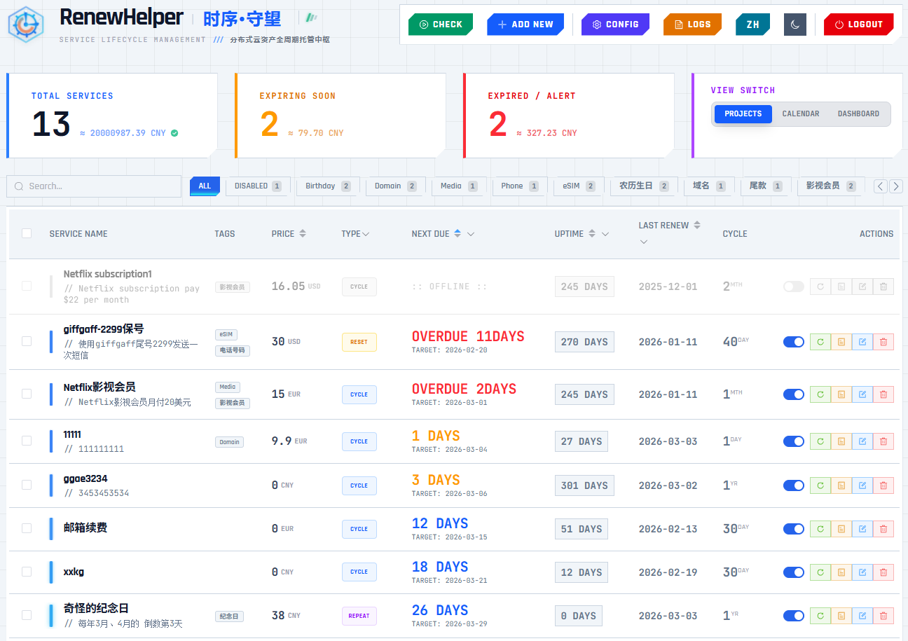
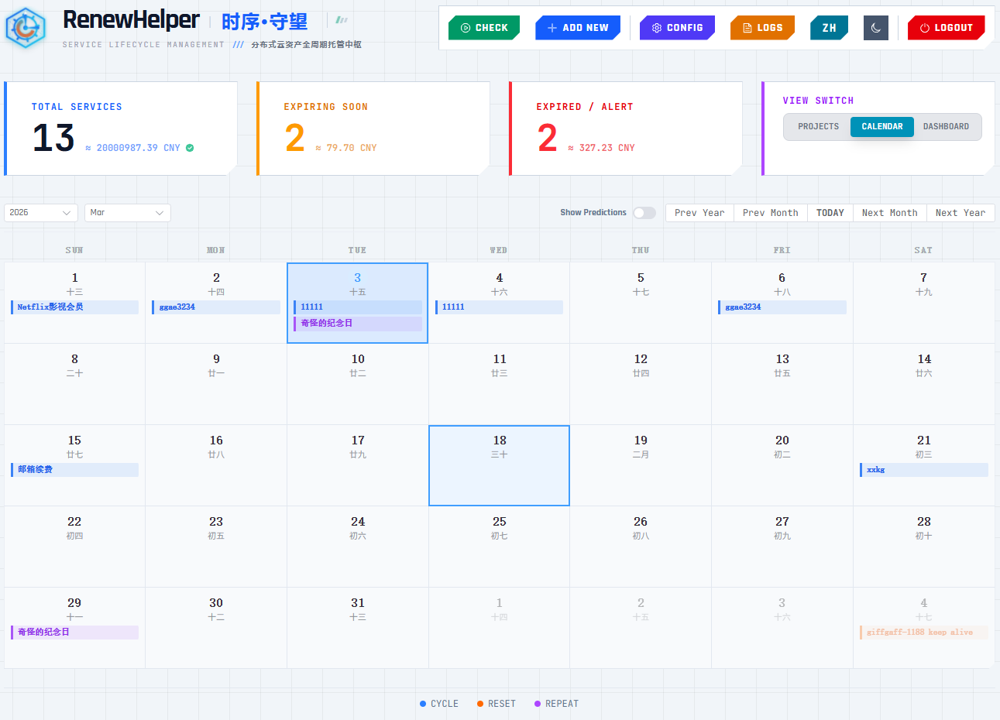
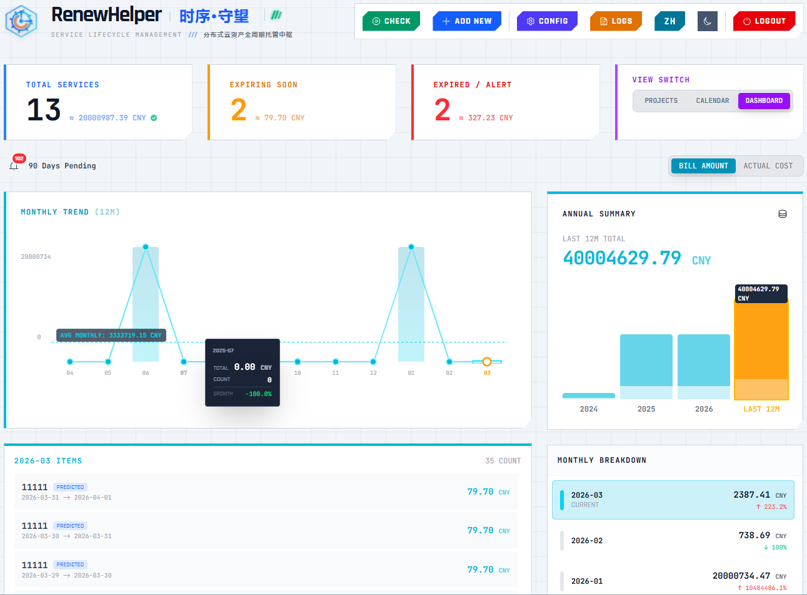
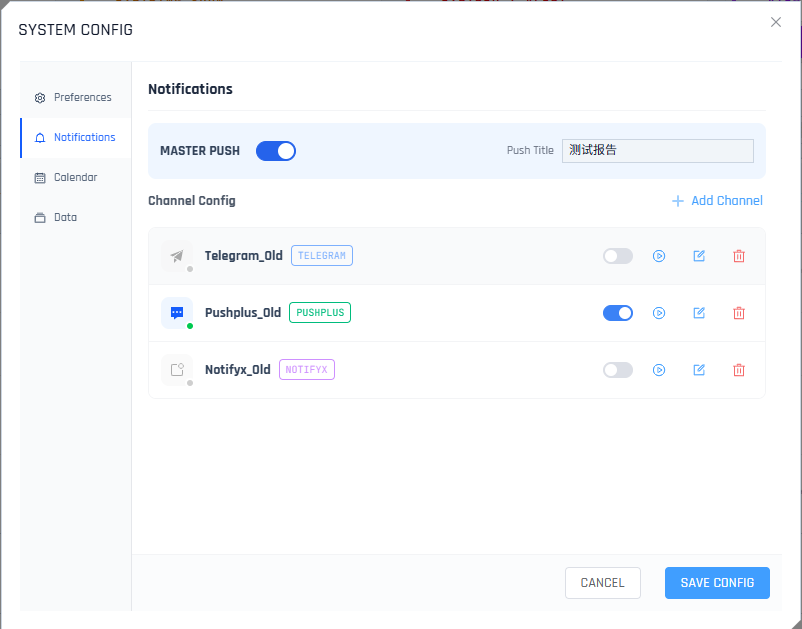
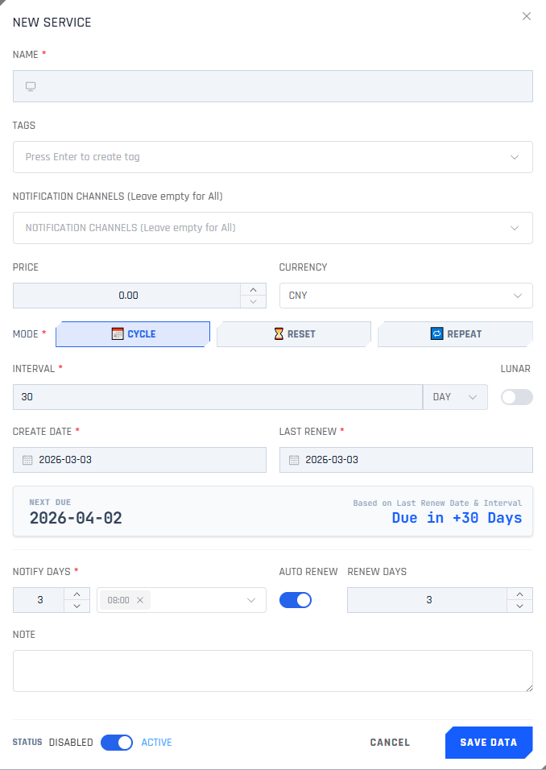

# 🕒 RenewHelper - Service Lifecycle Manager

**[English]** | [中文](./README.md)


**RenewHelper** is a full-stack service lifecycle reminder and management tool based on **Cloudflare Workers**. It is designed to manage periodic subscriptions, domain renewals, server expirations, and more. It requires no server (Serverless), incurs zero hosting costs, and features a stunning Mecha-style UI, a powerful Lunar/Solar calendar core, multi-channel notifications, and iCal schedule synchronization. **It supports both Worker and Docker deployments. v2.x introduces a cash flow dashboard with comprehensive billing management features. v3.x features a fully refactored frontend/backend separation and can run independently without any CDN dependencies.**

<div align="center">
  
   
   
</div>

## ✨ Key Features

- **⚡️ Serverless Architecture**: Runs entirely on Cloudflare Workers using KV storage. No VPS required, and the free tier is usually sufficient for personal use. It also supports standalone Docker deployment and can run independently without relying on any CDN.
- **📅 Smart Cycle Management**:
  - Supports both **Solar (Gregorian)** and **Lunar** calendar cycles. Built-in high-precision Lunar algorithm (1900-2100).
  - Perfect for handling monthly/yearly subscriptions (Solar) or birthdays/traditional festivals (Lunar).
  - Supports automatic calculation based on Day, Month, or Year intervals.
  - Three modes: "Cycle Subscription" (Repeating), "Expiration Reset" (Manual extension) and "Repeat" (Fixed Schedule).
- **🔔 Multi-Channel Notifications**:
  - Built-in support for **Telegram, Bark, PushPlus, ServerChan3, DingTalk, Lark (Feishu), WeCom, NotifyX, Resend (Email), Gotify, Ntfy, Webhook**.
  - Allows adding **unlimited** notification channels, supporting different channels for each project. Supports **batch management** and **quick assignment**.
  - Support customizable push titles, advance notice days, and daily push times.
- **💰 Billing & Spending Dashboard** (New v2.0+):
  - Stunning visualization of your spending trends by month and year.
  - **Multi-currency** support with automatic exchange rate conversion.
  - Distinguish between **Bill Amount** (Budget) and **Actual Cost** (Paid).
  - Preview upcoming bills for the next n days.
- **🤖 Automation**:
  - **Auto-Renew**: Automatically updates the next due date upon expiration.
  - **Auto-Disable**: Automatically marks services as disabled if they are overdue for too long.
  - **Cron Triggers**: Supports daily scheduled checks via Cloudflare Cron Triggers.
- **📆 Calendar View & ICS Subscription**: 
  - Features an intuitive **built-in visual calendar** to display current renewals and predict future pending items.
  - Generates standard `.ics` subscription links. Seamlessly integrates with iOS Calendar, Google Calendar, or Outlook, supporting timezone-aware precise reminders synchronized to your phone.
- **🛡️ Secure & Reliable**:
  - JWT authentication with automatic high-strength key generation.
  - Hybrid rate-limiting strategy (Memory + KV) to prevent brute-force attacks.
  - Data is stored only in your private Cloudflare KV.
  - Sensitive operations (Delete, Reset) require secondary confirmation.
- **🎨 Modern UI**:
  - Single-file frontend built with Vue 3 + Element Plus.
  - Dark/Light mode support with smooth view transition animations.
  - Convenient list multi-selection and batch operations (batch delete, pause/enable, assign notifications).
  - Fully responsive design for mobile and desktop.
  - Bilingual interface (English/Chinese).
  - Data Import/Export for backup.

---

## 🚀 Deployment Guide

### Method 1: One-Click Deployment (Recommended)

[](https://deploy.workers.cloudflare.com/?url=https://github.com/ieax/renewhelper)

1.  Click the button above.
2.  Authorize Cloudflare to access your GitHub account (to Fork the repository).
3.  Follow the instructions to complete the deployment. Cloudflare will automatically create the Worker and KV Namespace for you.
4.  **IMPORTANT**: After deployment, go to Cloudflare Dashboard -> Workers & Pages -> Your Project -> **Settings** -> **Variables**.
    - Add Environment Variable: `AUTH_PASSWORD`. Set the value to your desired login password (default is `admin`).
    - Bind KV Namespace: Ensure the variable name is `RENEW_KV` (Do not change this name!).

### Method 2: Manual Deployment (Web Dashboard)

If you don't use GitHub, you can deploy directly via the Cloudflare Dashboard.

#### Step 1: Create a KV Namespace

1.  Log in to the [Cloudflare Dashboard](https://dash.cloudflare.com/).
2.  Go to **Workers & Pages** -> **KV** from the left menu.
3.  Click **Create a namespace**.
4.  Enter the name: `RENEW_KV` or any name you prefer (Uppercase recommended), then click **Add**.

#### Step 2: Create a Worker Service

1.  Go back to **Workers & Pages** -> **Overview**.
2.  Click **Create application** -> **Create Worker**.
3.  Name your worker (e.g., `renewhelper`) and click **Deploy**.
4.  Once deployed, click **Edit code** to open the editor.

#### Step 3: Paste Code

1.  In the file list on the left, select `worker.js`.
2.  **Select All and Delete** the default code.
3.  Copy and paste the complete code from `_worker.js` provided in this project.
4.  Click **Deploy** on the top right to save.

#### Step 4: Bind KV Database (Crucial)

1.  Click the arrow in the top left to return to the Worker details page.
2.  Go to **Settings** -> **Variables**.
3.  Scroll down to **KV Namespace Bindings**.
4.  Click **Add binding**:
    - **Variable name**: Must be `RENEW_KV` (Do not change this!).
    - **KV Namespace**: Select the namespace you created in Step 1.
5.  Click **Save and deploy**.

#### Step 5: Set Login Password

1.  Still on the **Variables** page, scroll up to **Environment Variables**.
2.  Click **Add variable**:
    - **Variable name**: `AUTH_PASSWORD`
    - **Value**: Enter your desired password (default is `admin` if left unset).
3.  Click **Save and deploy**.

#### Step 6: Set Cron Trigger

To enable auto-renewal and notifications, **you must set a Cron Trigger.**

1.  Click the **Triggers** tab at the top.
2.  Scroll down to **Cron Triggers**.
3.  Click **Add Cron Trigger**.
4.  **Cron schedule**: Enter `0,30 * * * *` exactly (This means check every 30 minutes. Do not change this logic!).
5.  Click **Add Trigger**.

### Method 3: Deploy via GitHub Actions (Recommended)
This method is ideal for users who prioritize **privacy** and want **automatic updates**. It eliminates the need to authorize third-party applications, keeping all your credentials securely stored within your own GitHub repository.

1. **Fork the Repository**: Click the **Fork** button in the top-right corner of this page to copy the project to your own GitHub account.
2. **Prepare Cloudflare Credentials**:
   - **Account ID**: Find this on the right side of the Cloudflare Workers dashboard overview.
   - **API Token**: Go to [My Profile](https://dash.cloudflare.com/profile/api-tokens) -> API Tokens -> Create Token -> Use the **Edit Cloudflare Workers** template -> Generate and copy the token.

3. **Create KV Namespace**:
   - Create a new KV namespace (e.g., `RENEW_KV`) in the Cloudflare dashboard.
   - Copy the **ID** of this new KV.

4. **Configure GitHub Secrets**:
  - Go to your forked repository -> **Settings** -> **Secrets and variables** -> **Actions**.
  - Click **New repository secret** and add the following 4 secrets:
    - `CF_API_TOKEN`: Paste your Cloudflare API Token.
    - `CF_ACCOUNT_ID`: Paste your Cloudflare Account ID.
    - `CF_KV_ID`: Paste your copied KV ID (Actions will automatically inject this).
    - `AUTH_PASSWORD`: Enter your desired login password (Once set, it will not be overwritten even when syncing code).

5. **Enable and Deploy**:
   - Navigate to the **Actions** tab and click the green button **I understand my workflows...** to enable them.
   - Select **Deploy to Cloudflare Workers** from the sidebar, then click **Run workflow** to trigger the initial deployment manually.
   - **Updates**: Whenever a new version is released, simply click **Sync Fork** on your GitHub repository page. GitHub Actions will automatically deploy the latest code (including new features) to your Worker while preserving your password settings.

### Method 4: Docker Deployment

RenewHelper can be easily deployed using Docker. This method simulates the Cloudflare Workers environment locally using Miniflare, ensuring your data remains private and self-hosted.

#### Prerequisites

  * Docker Engine installed
  * Docker Compose installed

#### Quick Start

1.  Create a directory for RenewHelper (e.g., `renewhelper`).
2.  Create a file named `docker-compose.yml` inside that directory with the following content:

```yaml
services:
  renew-helper:
    # Official Image
    image: ieax/renewhelper:latest
    container_name: renew-helper
    restart: unless-stopped
    ports:
      - "9787:9787" # Map container port 9787 to host port 9787
    volumes:
      # Data persistence: Maps host's ./data folder to container's data storage
      - ./data:/data
    environment:
      # --- Configuration ---
      
      # 1. Login Password (Required)
      - AUTH_PASSWORD=MySecretPassword
      
      # 2. Cron Schedule (Important!)
      # Recommendation: Run every 30 minutes to match the frontend settings.DO NOT CHANGE！！！
      # Syntax: "0,30 * * * *" means trigger at minute 0 and minute 30 of every hour.
      - CRON_SCHEDULE=0,30 * * * *
      
      # 3. Timezone
      # Sets the container timezone. This affects when the Cron triggers.
      - TZ=Asia/Shanghai
```

3.  Start the container:

    ```bash
    docker compose up -d
    ```

4.  **Configure HTTPS Reverse Proxy (Required)**: RenewHelper depends on **Web Crypto API** for core encryption/decryption, thus it **MUST run under HTTPS** (except localhost). Please configure Nginx, Caddy, or other reverse proxies with SSL certificates.

<details>
<summary><strong>🔒 Deployment Guide: Caddy Reverse Proxy (Recommended)</strong></summary>

#### 1. Modify `docker-compose.yml`

Update your `docker-compose.yml` to include the Caddy service and link it to RenewHelper.

```yaml
services:
  renew-helper:
    image: ieax/renewhelper:latest
    container_name: renew-helper
    restart: unless-stopped
    # No need to map ports to host, just expose to Caddy
    expose:
      - "9787"
    volumes:
      - ./data:/data
    environment:
      - AUTH_PASSWORD=admin
      - CRON_SCHEDULE=0,30 * * * *
      - TZ=Asia/Shanghai

  caddy:
    image: caddy:alpine
    container_name: caddy-proxy
    restart: unless-stopped
    ports:
      - "80:80"
      - "443:443"
    volumes:
      - ./Caddyfile:/etc/caddy/Caddyfile
      - caddy_data:/data
      - caddy_config:/config
    depends_on:
      - renew-helper

volumes:
  caddy_data:
  caddy_config:
````

#### 2\. Create `Caddyfile`

Create a file named `Caddyfile` (no extension) in the same directory:

```caddy
# Replace with your actual domain
your-domain.com {
    encode gzip
    reverse_proxy renew-helper:9787
}
```

#### 3\. Run

```bash
docker compose up -d
```

Your service will be available at `https://your-domain.com`.
</details>

#### ⚠️ Important: Timezone Alignment

To ensure reminders are triggered at the correct moment, please keep **both** of the following settings consistent:

1. **Docker Environment Variable (`TZ`)** – controls when RenewHelper “wakes up” to run the cron job.
2. **Web UI → Settings → Timezone** – controls what time RenewHelper thinks it is once it wakes up.

#### 💾 Data Management

  * **Location**: All data (subscriptions, settings, logs) is stored in the `./data` directory in the same folder as your `docker-compose.yml`.
  * **Backup**: Simply backup the `./data` folder.
  * **Migration**: Copy the `./data` folder to a new server to restore your data.

#### 🔄 Updating

To update to the latest version:

```bash
# 1. Pull the latest image
docker compose pull

# 2. Recreate the container
docker compose up -d
```

### Telegram Proxy Service (Optional)

> ⚠️ **For mainland China users**: due to network restrictions, servers located in China may be unable to reach the Telegram API. You can deploy the lightweight proxy shipped with this project. It works with Workers/Pages/Snippets (priority: Snippets > Pages > Workers).

1. **Prepare the file**: copy the code from `renewhelper/telegram_proxy/_worker.js`.
2. **Create a Worker/Pages/Snippets service**:
   - In the Cloudflare dashboard create a new Worker/Pages/Snippet (e.g., `tg-proxy`).
   - Paste the code and deploy.
3. **Configure whitelist (`TG_ALLOW_TOKENS`)**:
   - In Settings → Variables add `TG_ALLOW_TOKENS` (for Pages redeploy after change).
   - The value should contain the bot tokens you allow (comma separated).  
     *If you don't want to use environment variables, edit the `WHITELIST_TOKENS` constant in code instead.*
4. **Usage**:
   - Your proxy endpoint will be `https://tg-proxy.your-subdomain.workers.dev` or any custom domain you bind.
   - It can act as a transparent proxy for Telegram APIs, supporting `POST /bot<Token>/<Method>` requests.
   - *This helper exists purely to solve environments where Docker deployments cannot reach Telegram directly.*

### 🎉 Deployment Complete!

---

## ⚙️ Configuration

After deployment, visit your Worker URL or custom domain (e.g., `https://renewhelper.your-name.workers.dev`).

1.  **First Login**: Unlock using the `AUTH_PASSWORD` you set (default `admin`).
2.  **System Settings**: Click the **SETTINGS** button in the top right corner.
    - **Timezone**: Critical! Select your local timezone (e.g., `Asia/Shanghai` or `America/New_York`). This determines the accuracy of reminders and calendar events.
    - **Master Notification Switch**: Enable to configure specific notification channels.

<div align="center">
  
</div>

### 📢 Notification Channels

In the "Settings" -> "Notifications" section, click the **Add Channel** button, select the type, and fill in the parameters. The system supports configuring **unlimited** notification channels simultaneously. You can **Send Test** to verify connectivity, and use the **Select All/Inverse** & **Batch Action Bar** above the list to enable, disable, delete, or **one-click assign** channels to specific services.

| Channel            | Parameter Description                                                       | How to Obtain/Configure                                                                                                                                                                                                                                  |
| :----------------- | :-------------------------------------------------------------------------- | :------------------------------------------------------------------------------------------------------------------------------------------------------------------------------------------------------------------------------------------------------- |
| **Telegram**       | **Token**: Bot Token<br>**Chat ID**: Your User ID or Group ID               | 1. Create a bot via [@BotFather](https://t.me/BotFather) to get the Token. Add `@userinfobot` to get your UserID。<br>2. Or visit `https://api.telegram.org/bot<YourToken>/getUpdates` in your browser.<br>3. Send a message to your bot.<br>4. Refresh the URL above to find your Chat ID.         |
| **Bark** (iOS)     | **Server**: Server URL<br>**Device Key**: Key                               | 1. Download the Bark App from the App Store.<br>2. Copy the Server URL and Key displayed in the App.                                                                                                                                                     |
| **PushPlus**       | **Token**: User Token                                                       | 1. Visit [PushPlus Official Site](https://www.pushplus.plus/).<br>2. Login via WeChat to get your Token.                                                                                                                                                 |
| **NotifyX**        | **API Key**: Key                                                            | 1. Visit [NotifyX Official Site](https://www.notifyx.cn/).<br>2. Login to get your API Key.                                                                                                                                                              |
| **Resend** (Email) | **API Key**: Resend Key<br>**From**: Sender Email<br>**To**: Receiver Email | 1. Register at [Resend](https://resend.com/).<br>2. Bind a domain and get an API Key.<br>3. `From` must be a verified domain email (e.g., `alert@yourdomain.com`). If you don't have one, use `onboarding@resend.dev` and send to your registered email. |
| **Lark** (Feishu)  | **Token**: The UUID from the Webhook URL<br>**Secret**: (Optional) Security sign secret | 1. Lark Group Settings -> Bots -> Add Bot -> Custom Bot.<br>2. Extract the UUID at the end of the Webhook URL (e.g., `xxxxxxxx-xxxx-...`) as Token.<br>3. Fill in Secret if enabled.                                                                                      |
| **WeCom**          | **Key**: The key parameter from the Webhook URL                                  | 1. WeCom Group Settings -> Add Group Robot.<br>2. Extract the string value after `key=` in the Webhook URL (e.g., `693xxxx...`).                                                                                                                                           |
| **Gotify**         | **Server**: URL<br>**Token**: App Token                                     | Self-hosted Gotify server. Create an Application to get the Token.                                                                                                                                                                                                       |
| **Ntfy**           | **Server**: URL (Def: ntfy.sh)<br>**Topic**: Topic<br>**Token**: Token      | 1. **Server**: Leave empty for default `https://ntfy.sh`.<br>2. **Topic**: The topic name you subscribed to.<br>3. **Token**: (Optional) Required if your topic is protected.                                                                                          |
| **ServerChan3**    | **UID**: User ID<br>**SendKey**: Send Key                                   | 1. Login to [ServerChan3](https://sc3.ftqq.com/).<br>2. Get UID and SendKey.                                                                                                                                                                                                                                             |
| **DingTalk**       | **Token**: access_token<br>**Secret**: (Optional) Sign Secret                 | 1. DingTalk Group -> Intelligent Assistant -> Add Robot -> Custom.<br>2. Security Settings: Recommend **Sign** (Secret) or **Custom Keywords**.<br>3. Copy `access_token` and `SEC...` (Secret) from Webhook URL. If using Custom Keywords, ensure it includes `Renew`.                                                  |
| **Webhook**        | **URL**: POST URL                                                           | For custom development. The system sends a POST request: `{ "title": "...", "content": "..." }`. [Webhook Configuration Guide](./webhook_guide_en.md)                                                                                                                                                        |

---

## 🛠 Usage

### Adding a Service

<div align="center">
  
</div>

- **Name**: Service name (e.g., "Netflix 4K", "Google Voice - 8888").
- **Tags**: For categorization (e.g., `Media`, `Server`, `Domain`, `PhoneNumber`). Supports multiple tags.
- **Mode**:
  - 📅 **Cycle Subscription**: For items that expire every fixed cycle (e.g., 1 Month / 1 Year). Good for monthly subs, VPS renewals.
  - ⏳ **Expiration Reset**: For items that need manual/auto handling upon expiration to extend validity. Good for eSIM validity extension (e.g., extend 180 days on top-up).
  - 🔁 **Repeat (Fixed Schedule)**: Built on a powerful RRULE engine. Suitable for recurring events based on natural habits like "the second Friday of every month" or "every two weeks on Wednesday and Sunday." 
- **Lunar Cycle**: Enable this for calculations based on the Lunar calendar (Birthdays, traditional events).
- **Advance Notice**: Freely choose how many days in advance to receive notifications; supports **multiple time selections** (e.g., selecting both "8:00" and "18:00").
- **Automation Policy**:
  - **Auto-Renew**: Automatically extends the next due date by one cycle upon expiration.
  - **Auto-Disable**: Automatically marks the service as disabled if it remains overdue for a specified number of days.
- **Renew Link**:
  - Optional. When filled, a “Renew” button appears in the manual renewal dialog so you can quickly jump to the payment/renewal page.

### Batch Operations
In the project list view, you can check the checkboxes on the left side of the list to perform **batch deletion**, **batch pause/enable**, and the highly practical **batch assign notification channels** function (quickly bind the same push channels to a group of services).


### Viewing Logs

Click the **LOGS** button on the main interface to view history of automation tasks, push results, and operation audits.

### ICS Calendar Subscription & Calendar View

On the main interface, you can click on the top right to switch to the **Calendar Visual View** (which not only intuitively displays the renewal events of the current month but also features a top switch to display future predicted pending items).
In addition, you can obtain the **Calendar Subscription** link in the "Settings" menu:

1.  Copy the subscription link.
2.  **iOS**: Settings -> Mail -> Accounts -> Add Account -> Other -> Add Subscribed Calendar.
3.  **Google Calendar**: Add calendar -> From URL.
4.  **Outlook**: Add Calendar -> Subscribe from web.
5.  **Note**: The link contains a security token. Do not share it. If leaked, click "Reset Token".

### 💰 Billing & Spending Dashboard

Click the toggle button at the bottom of the main interface to enter the **Spending Dashboard**:

1.  **Monthly Trends**: View spending curves for the past 12 months.
2.  **Annual Summary**: View total spending for the last 3 years.
3.  **Bill vs. Actual**:
    - **Bill Amount**: Calculated based on the "Fixed Price" setting of your services.
    - **Actual Cost**: Calculated based on the actual amount recorded in renewal history.
4.  **Multi-Currency**: The system automatically queries real-time exchange rates to convert all currencies into your "Default Currency" for aggregated display.

### 📜 History Records

1.  **Renew**: Best for current renewal. The system automatically calculates the next start/end date based on the previous cycle.
2.  **Add History**: Best for backfilling past records. Switch to "Add History Mode" to manually insert billing records for any time period.
3.  **Edit History**: Click the "History" button on the right side to view and correct details (Price, Date, Note) of every past transaction.

### 💾 Data Migration

The system supports full data import/export for backup or migration purposes.

1.  **Export**: Click "Export Data" in the top-right menu and download the `.json` backup file via the secure link.
    *   *Includes: All services, renewal history, system settings.*
    *   *Excludes: Sensitive JWT Secret (New system's secret is preserved upon import).*
2.  **Import**: Find the "Import Data" section at the bottom of "Settings", paste the content of your backup file, and submit.
    *   *Note: Import is **OVERWRITING**. It is recommended to backup current data before importing.*

### 🔐 Backup API (Advanced)

RenewHelper provides a dedicated API endpoint for automated data backup via scripts without dashboard login.

1.  **Set Key**:
    - Go to **Settings** -> **Data Management**.
    - Set a strong **Backup Key** (at least 8 chars, alphanumeric). Save settings (leave empty to disable).
2.  **Call API**:
    - **Endpoint**: `GET /api/backup`
    - **Header**: `X-Backup-Key: YOUR_KEY`
    - **Response**: JSON backup data.

**Example (curl)**:

```bash
curl -H "X-Backup-Key: YourSecretKey123" https://your-worker.dev/api/backup > backup_$(date +%F).json
```

> ⚠️ Note: For security reasons, the Backup API has strict brute-force protection (5 failures in 5 min will result in a 15 min IP ban). Please keep your key safe.

### 🔄 Migrate from Older Versions

If you are upgrading from v1.x to v3.x, the data structure is backward compatible.

1.  **Export** data from the old version to get the `.json` file.
2.  Deploy the new version of the Worker (overwrite `_worker.js`).
3.  **Import** the backup file in the new version.
4.  The system automatically recognizes and adapts old data; missing fields (e.g., currency, history) will be filled with default values. All channels will be automatically migrated.


---

## ⚠️ Notes

1.  **Data Security**: All data is stored in your Cloudflare KV. It is recommended to manually export JSON backups regularly.
2.  **Free Tier Limits**: (This limitation does not apply to Docker deployment.)
    - Cloudflare Workers Free Tier is limited to 100,000 requests per day.
    - KV writes are limited to 1,000 per day.

---

## 🤝 Contribution & Support

If you find bugs or have feature suggestions, feel free to submit an Issue or Pull Request.

### 💖 Donation

If RenewHelper helps you, consider buying the author a coffee ☕️. Your support keeps the updates coming!

**Crypto** - International

| Crypto | Network | Address (Click to Copy) |
| :--- | :--- | :--- |
| **USDT** | **BSC (BEP20)** / Polygon / ETH | `0x0de4d19673cbdf954cfb83c0a48abb5ce8f6bf58` |

> ⚠️ Warning：Support USDT on BSC (BEP20), ETH or Polygon networks (Low fees).，DO NOT USE TRC20 ！！！

**Aifadian** - CN Users

[](https://afdian.com/a/lostfree)

---

**License**: MIT
Copyright (c) 2025-2026 LOSTFREE
